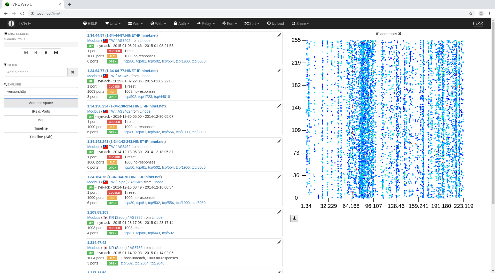
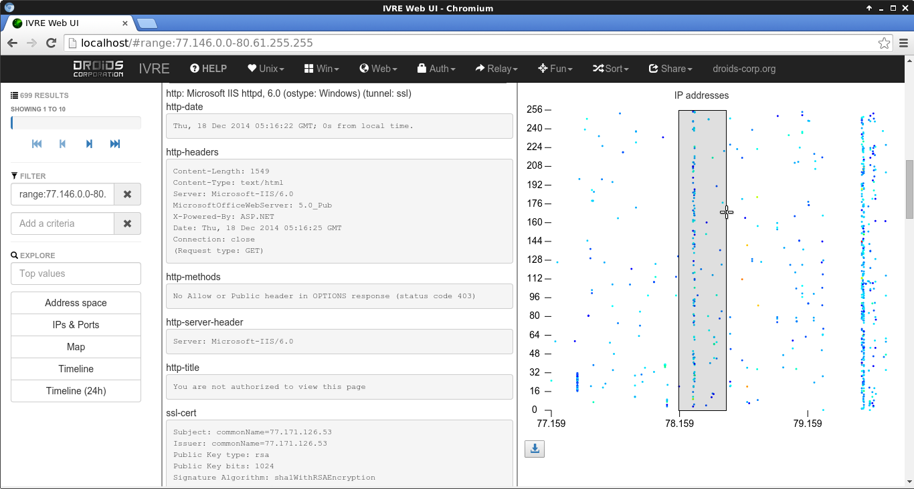
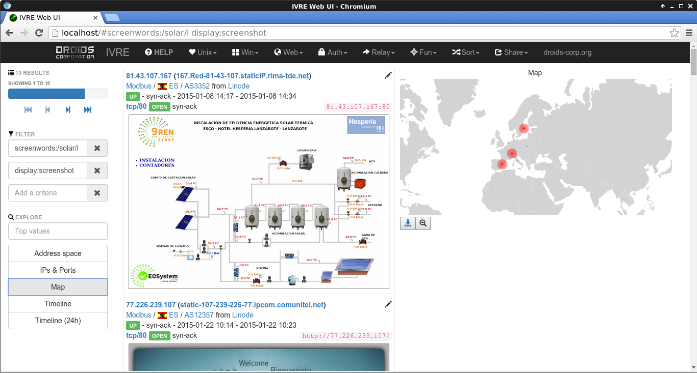
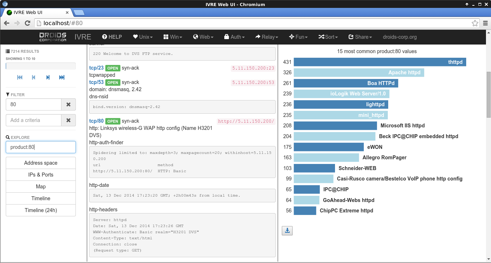
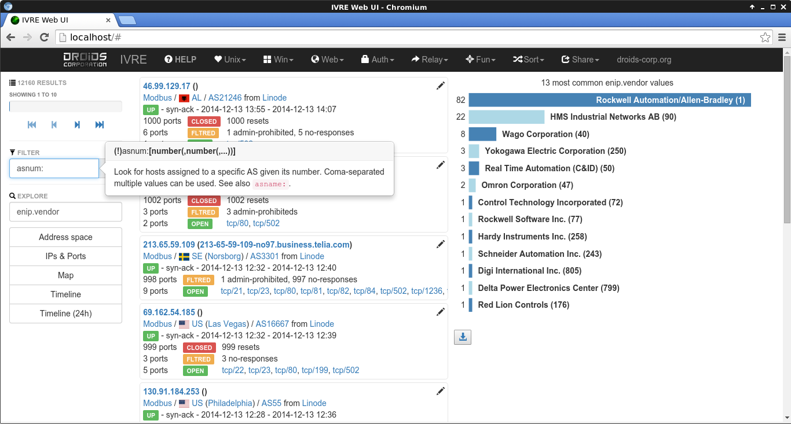
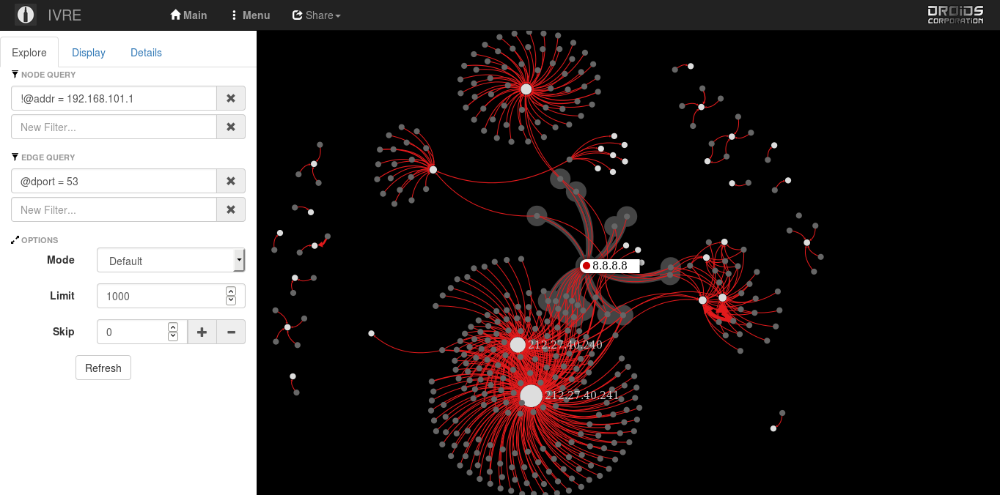
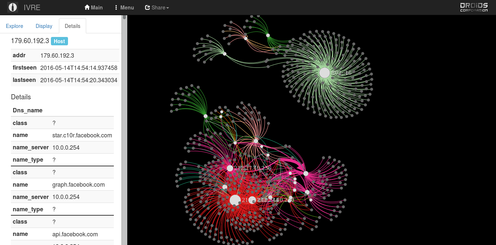
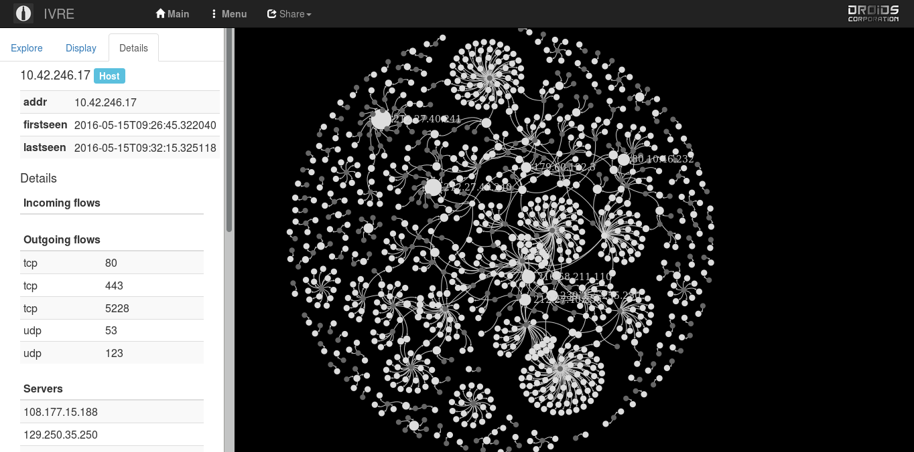

# IVRE's screenshots gallery #

## Nmap results ##

Home page with "heatmap" IP addresses.

Scan result details, using the "heatmap" IP addresses to "zoom" in the
address space

Screenshots containing the word "solar" and map

Most common products seen on port 80

Help tooltip and most common ENIP vendors

## Flow analysis ##

DNS flows with halo to show connected nodes

Flows with details for a specific host

Flows with details for a specific flow

Flow map

---

This file is part of IVRE. Copyright 2011 - 2015
[Pierre LALET](mailto:pierre.lalet@cea.fr)
